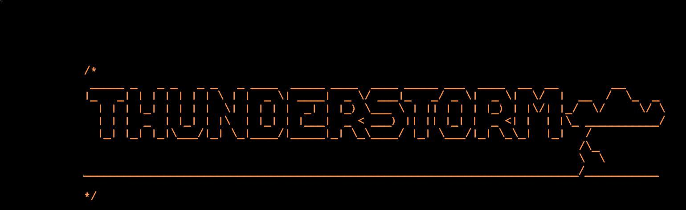

[](https://travis-ci.com/Igor1101/THUNDERSTORM)
**Is an embedded UNIX-like system**, which aims 
to be as portable as possible and use modern hardware features when possible.
Have similar to UNIX sources tree:
```
src/ # System programs sources
bin/ #system programs binaries
kernel/ # Portable kernel sources
libc/ # Kernel libc
arch/ # HW dependent kernel sources
arch/$(ARCH)/boot # HW dependent initialization
arch/$(ARCH)/lld/ # low level built-in drivers
arch/$(ARCH)/include/asm # headers, those provide machine-independent symbols
# we can use them in high level code
arch/$(ARCH)/include/$(ARCH) # specific to machine symbols/namespaces
```
....

##### Dependencies:
GNU make,
nasm,
gcc(version >=7), 
binutils, 
coreutils,
Unix shell(sh),
qemu-system-x86_64(optional),
OVMF(optional), 
grub-mkrescue,
xorriso
#### compilation have been verified under:
Arch linux,
FreeBSD 11
#### Running it on qemu!
please consult make tasks:
```
make help
```
Running os with different BIOS(for example OVMF.fd, which is UEFI/BIOS):
```
make run BIOS=$(find /usr/share -name OVMF_CODE.fd)
```
Note, that THUNDERSTORM aims to be BIOS independent, 
but it is much better in qemu to run it with UEFI BIOS, since
it is better supported.

#### TODO up to 2019 (in case someone want`s to contribute):
NOTE: to see full list of TODOs please run `grep -r -n TODO\ :` in target folder
- [ ] port multitasking from [THUNDERSTORM-OLD](http://github.com/Igor1101/THUNDERSTORM-OLD)
- [ ] ACPI support and power management
- [ ] PIC management
- [ ] local and IO APIC initialization \ management
- [ ] basic POSIX system calls
- [ ] add modules support
- [ ] Extended fs support (module)
- [ ] ISO 9660 support (module)
