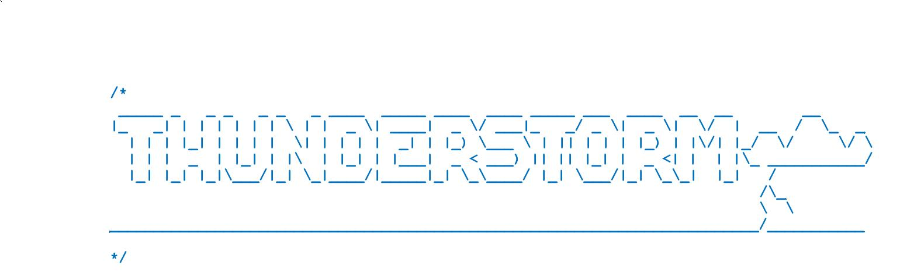

**Is an embedded UNIX-like system**, which aims 
to be as portable as possible and use modern hardware features when possible.
Have similar to UNIX sources tree:
#### System programs sources:
```
src/ 
```
#### Portable kernel sources:
```
kernel/
```
#### HW dependent kernel sources:
```
arch/
```
#### Kernel libc:
```
libc/
```
....

